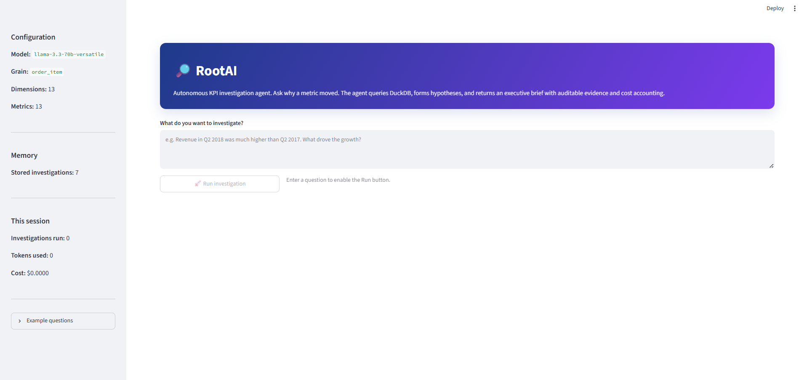
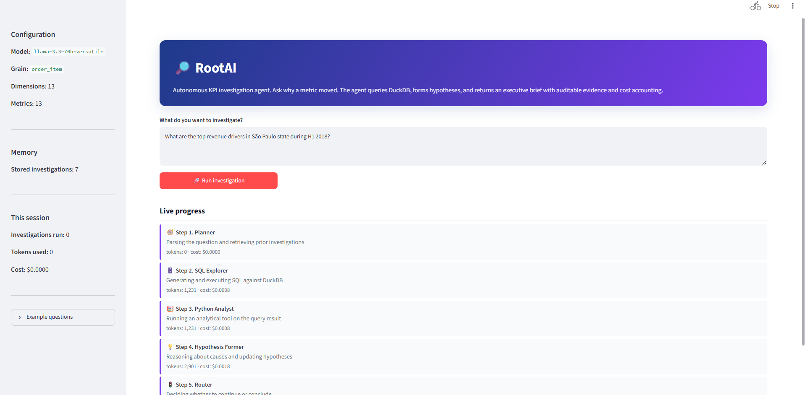
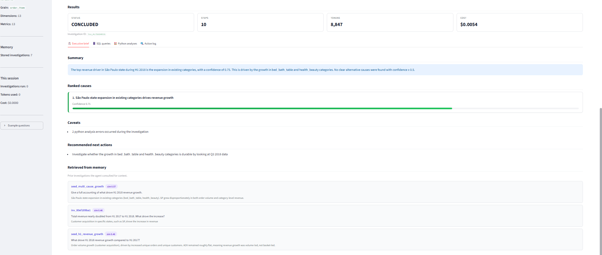
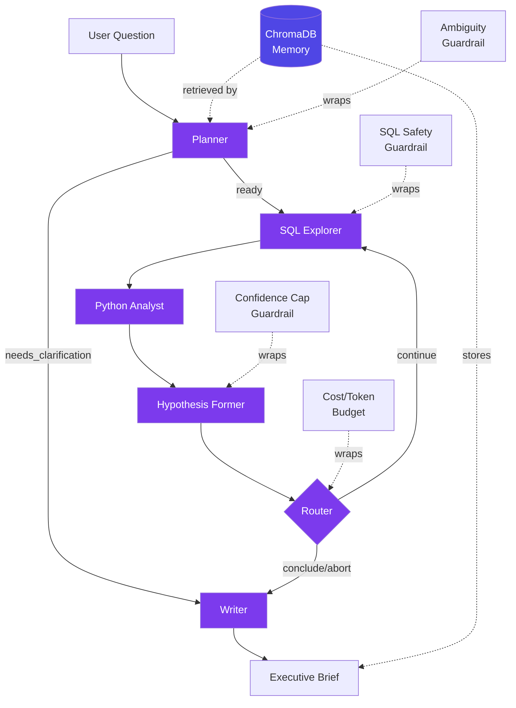

# 🔎 RootAI

**Autonomous KPI investigation agent.** Ask why a metric moved. The agent queries a real BI dataset, forms hypotheses, tests them with SQL and Python, and returns a confidence-scored executive brief with auditable evidence.

Built as a portfolio project demonstrating LangGraph state machines, structured LLM outputs, ChromaDB memory, guardrails, and evaluation against labeled ground truth.

---

## What it does

Given a question like *"Why did Q2 2018 revenue grow versus Q2 2017?"*, the agent:

1. **Parses** the question into a structured KPI query (kpi, direction, time windows)
2. **Retrieves** semantically similar prior investigations from ChromaDB
3. **Generates SQL** against a DuckDB instance of the Olist Brazilian E-commerce dataset (112k line items)
4. **Runs analytical tools** (contribution analysis, top-K, percent-change) on the results
5. **Forms hypotheses** with linked evidence, updating confidence as more evidence accumulates
6. **Routes** through additional exploration loops until confidence exceeds threshold or budget is exhausted
7. **Writes** an executive brief with ranked causes, caveats, and recommended actions

The entire investigation is a state machine with six LLM-backed nodes and four guardrail layers.

---

## Live demo
**Try it now:** [https://rootai-vkqy.onrender.com](https://rootai-vkqy.onrender.com)

Deployed on Render.com free tier. First visitor after inactivity waits ~30 seconds for the container to wake (Render's free tier sleeps after 15 minutes of no traffic). Local setup instructions in [Run locally](#run-locally) below.


**Screenshots:**



*Homepage with the investigation form, sidebar showing 7 stored prior investigations, and cost tracking.*



*The agent streams per-node progress with cumulative token counts as each investigation step completes. Icons denote which of the six graph nodes is executing.*



*Ranked causes with color-coded confidence bars, executive summary, and retrieved prior investigations from ChromaDB. Investigation ran in 10 steps at $0.0054 total cost.*

**Deployment notes:** Streamlit Community Cloud (defaulted to Python 3.14, broke chromadb -> tokenizers -> PyO3 chain), Hugging Face Spaces (Docker Spaces moved to paid tier). Render.com Free tier works because it honors PYTHON_VERSION env var pinning.


## Architecture



- **State schema:** Pydantic `InvestigationState` with LangGraph reducers. Custom `upsert_by_id` reducer for hypotheses/evidence lets nodes emit updates in a single structured output call.
- **Restricted Python execution:** LLM picks from a whitelist of analytical functions (`contribution_analysis`, `top_k_by_dimension`, `pct_change_summary`) with typed arguments. No `exec()`, no arbitrary code generation.
- **Memory:** Local `all-MiniLM-L6-v2` embeddings; zero external API calls for retrieval.

Full architecture rationale in [`docs/design_decisions.md`](docs/design_decisions.md).

---

## Evaluation

The agent is scored against 20 labeled cases in `evals/labeled_investigations.json`:

- **14 single-cause** (one primary driver expected)
- **2 multi-cause** (multiple contributing factors, partial-credit scoring)
- **4 null cases** (correct answer is "no isolable cause"; agent penalized for fabricating causes)

**Scoring is deterministic** (string containment + confidence-band checks) rather than LLM-as-judge, so results are reproducible.

**Current results:**

*[Placeholder: fill in after more cases have run. Update the following table with real numbers as evals complete.]*

| Case type   | N   | Avg score | Best case | Worst case |
|-------------|-----|-----------|-----------|------------|
| single_cause | 1  | 1.00      | olist_001 | -          |
| multi_cause | 0   | -         | -         | -          |
| null_case   | 0   | -         | -         | -          |
| **Overall** | **1** | **1.00**  |           |            |

Sample verbatim agent output (olist_001, revenue growth H1 2018 vs H1 2017):

> The nearly doubling of total revenue from H1 2017 to H1 2018 is primarily driven by customer acquisition growth, as evidenced by the significant increase in unique orders and customers.

Confidence: 0.60 (capped from 0.75 by the confidence-by-evidence guardrail, since only one evidence record supported the hypothesis).

Run the full eval suite yourself:

```bash
python evals/run_evals.py --dry-run       # preview all 20 cases
python evals/run_evals.py --start 0 --end 5   # run first 5 cases
```

Results appended to `evals/results/results.jsonl`.

---

## Run locally

**Prerequisites:** Python 3.11 (not 3.12 or 3.13), a free Groq API key, a free Kaggle account.

```bash
# 1. Clone
git clone https://github.com/Rcharmy/RootAI.git
cd RootAI

# 2. Create venv (Windows: py -3.11 -m venv venv; macOS/Linux: python3.11 -m venv venv)
py -3.11 -m venv venv
.\venv\Scripts\Activate.ps1  # Windows
# source venv/bin/activate    # macOS/Linux

# 3. Install
pip install -r requirements.txt

# 4. Configure secrets
cp .env.example .env
# Edit .env: add your GROQ_API_KEY from https://console.groq.com/keys

# 5. Get Kaggle credentials (see https://www.kaggle.com/settings > API > Create New Token in the Legacy panel)
# Move kaggle.json to ~/.kaggle/kaggle.json (or %USERPROFILE%\.kaggle\kaggle.json on Windows)

# 6. Download and build the Olist DuckDB
kaggle datasets download -d olistbr/brazilian-ecommerce -p data/raw --unzip
python data/setup_data.py

# 7. Seed the memory (optional; makes retrieval show up on the first query)
python scripts/seed_memory.py --clear

# 8. Run the CLI agent
python app.py "Revenue in Q2 2018 was much higher than Q2 2017. What drove the growth?"

# 9. Or run the Streamlit UI
streamlit run streamlit_app.py
```

---

## Repository structure
rootai/
├── app.py # CLI entry point
├── streamlit_app.py # Browser UI
├── requirements.txt
├── data/
│ ├── setup_data.py # One-shot: builds order_items_denorm view
│ ├── build_on_startup.py # Cloud-deploy bootstrapping
│ └── raw/ # 9 Olist CSVs (gitignored)
├── rootai/
│ ├── config.py # env + Streamlit secrets loader
│ ├── state.py # Pydantic state schema + reducers
│ ├── graph.py # LangGraph wiring
│ ├── nodes/ # 6 node implementations
│ │ ├── planner.py
│ │ ├── sql_explorer.py
│ │ ├── python_analyst.py
│ │ ├── hypothesis_former.py
│ │ ├── router.py
│ │ └── writer.py
│ ├── tools/
│ │ ├── llm.py # Groq client + usage accumulator
│ │ ├── db.py # Read-only DuckDB access
│ │ ├── analysis.py # Whitelisted analytical toolbox
│ │ └── dataset_context.py # Schema introspection
│ ├── memory/
│ │ └── store.py # ChromaDB persistence
│ └── guardrails/
│ ├── sql_safety.py # Pattern-based SQL check
│ └── confidence_cap.py # Max confidence by evidence count
├── evals/
│ ├── labeled_investigations.json # 20 ground-truth cases
│ ├── metrics.py # Deterministic scorers
│ ├── run_evals.py # Batch runner
│ └── results/
│ └── results.jsonl # Per-case scores (append-only)
├── docs/
│ └── design_decisions.md # Full architectural rationale
├── scripts/
│ ├── test_groq.py # Integration check
│ ├── test_confidence_cap.py # Unit test
│ ├── test_metrics.py # 10-case unit test suite
│ └── seed_memory.py # Populate ChromaDB with canonical investigations
└── traces/ # Per-investigation JSON traces (gitignored)

---

## Tech stack

| Layer          | Choice                    | Why                                                    |
|----------------|---------------------------|--------------------------------------------------------|
| LLM            | Llama 3.3 70B via Groq    | Free tier, fast, strong structured output              |
| Orchestration  | LangGraph                 | State machine + custom reducers                        |
| State schema   | Pydantic v2               | Type validation at LLM output boundaries               |
| Data           | DuckDB                    | Fast local analytics, zero setup                       |
| Memory         | ChromaDB (local embed)    | Persistent RAG without API cost                        |
| UI             | Streamlit                 | Fast to build, custom CSS for polish                   |
| Evaluation     | Deterministic scoring     | Reproducible, no LLM-as-judge                          |

---

## Design philosophy (short version)

Interviewers should be able to defend any decision from just reading the code. This means:

- **No LLM-generated Python.** The Analyst picks from a whitelist. Auditable, safe.
- **No LLM-as-judge for evals.** Deterministic scoring. Reproducible.
- **Read-only DuckDB.** Two guardrail layers before SQL executes (pattern check + connection lock).
- **Confidence caps by evidence count.** One evidence record cannot yield 0.99 confidence.
- **Router defaults to CONCLUDE on LLM failure.** Never loops against a rate-limited API.
- **"No isolable cause" is a valid, credited verdict.** Null eval cases test that the agent will decline to attribute when data is broadly distributed.

Full rationale in [`docs/design_decisions.md`](docs/design_decisions.md).

---

## Known limitations

- **Embedding model quality:** `all-MiniLM-L6-v2` clusters "any numeric decline" together loosely. Production would use `text-embedding-3-small` or a domain-fine-tuned model.
- **Hypothesis Former sometimes describes rather than causally frames.** Statements read like "growth was driven by X category increasing" (descriptive) rather than "X category increased because Y mechanism" (causal). Prompt-engineering iteration would tighten this.
- **SQL Explorer occasionally repeats slices.** Prompt tells it not to; it sometimes ignores.
- **Cloud deployment blocked upstream.** Streamlit Community Cloud defaults to Python 3.14 which breaks the chromadb -> tokenizers -> PyO3 chain. Local run is the current path.

---

## Attribution

Built by [Charmy Raj](https://github.com/Rcharmy). MIT license.

Olist dataset: [Kaggle - Brazilian E-Commerce Public Dataset by Olist](https://www.kaggle.com/datasets/olistbr/brazilian-ecommerce), CC-BY-NC-SA-4.0.